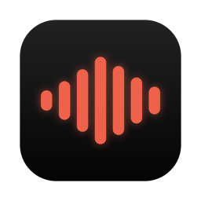

<p align="center">
  
</p>

# FVoice

App de ditado (speech-to-text) 100% local para macOS (Apple Silicon). Menu bar app, push-to-talk global, transcrição via WhisperKit no Neural Engine, foco em PT-BR.

## Instalação

1. Baixe o `.dmg` mais recente em [Releases](https://github.com/jacobaraujo7/fvoice/releases/latest).
2. Abra o `.dmg` e arraste o **FVoice** para a pasta **Applications**.
3. Abra o FVoice (ícone de waveform na barra de menu). O app é assinado e notarizado pela Apple, então abre sem avisos de segurança.
4. No primeiro uso, o **Setup Assistant** guia você: escolha de idioma e engine (o modelo Whisper baixa nessa hora, se escolhido), permissões (Microfone, Acessibilidade e Monitoramento de Entrada) e gravação do seu atalho.
5. Pronto: pressione seu atalho em qualquer app, fale, pressione de novo e o texto aparece no cursor.

Atualizações chegam automaticamente pelo próprio app (menu → Check for Updates), direto dos releases do GitHub.

Requisitos: macOS 14+ em Apple Silicon. O engine da Apple (SpeechTranscriber) requer macOS 26.

## Build

Requisitos: macOS 14+, Xcode CLT, [XcodeGen](https://github.com/yonaskolb/XcodeGen) (`brew install xcodegen`).

```sh
xcodegen generate
xcodebuild -scheme FVoice -configuration Debug build
```

O `.app` sai em `build/` (ou DerivedData, dependendo da invocação). O `.xcodeproj` é gerado e não é versionado.

## Assinatura e permissões

Assinado com certificado Apple Development (team `U843T2P7A2`), bundle id estável `com.jacobmoura.fvoice` — identidade estável faz as permissões (Microphone, Input Monitoring, Accessibility) sobreviverem a rebuilds. Lançar sempre via `open` (ou task Run do Cockpit): rodar o binário direto do terminal faz o TCC atribuir permissões ao terminal, não ao app.

## Arquitetura

DDD-lite: `Domain/` (entidades, use cases, protocolos — sem AVFoundation/WhisperKit), `Infrastructure/` (áudio, whisper, input, persistência), `App/` (SwiftUI, MenuBarExtra).

## Hotkey

Default: **⌥Space (Option+Space) em modo toggle** — pressione uma vez para começar a gravar, de novo para parar (decisão do usuário; substitui o default original de Right Option push-to-talk). O evento do hotkey é consumido pelo tap ativo, então o app em foco nunca recebe o Opt+Space.

## Status

- [x] M0 — Scaffold (menu bar app buildando via xcodebuild)
- [x] M1 — Captura de áudio (16kHz mono, wav de debug em `~/.fvoice/debug/`) + hotkey toggle ⌥Space
- [x] M2 — Transcrição (WhisperKit large-v3_turbo, `language: pt`, modelo em `~/.fvoice/models`)
- [x] M3 — Inserção no cursor (clipboard + ⌘V sintético com restore) + overlay de gravação
- [x] M4 — Robustez (VAD por RMS, blocklist de alucinações, troca de mic)
- [x] M5 — Settings (hotkey, idioma, modo de inserção, auto-Enter, launch at login; config em `~/.fvoice/config.json`)
